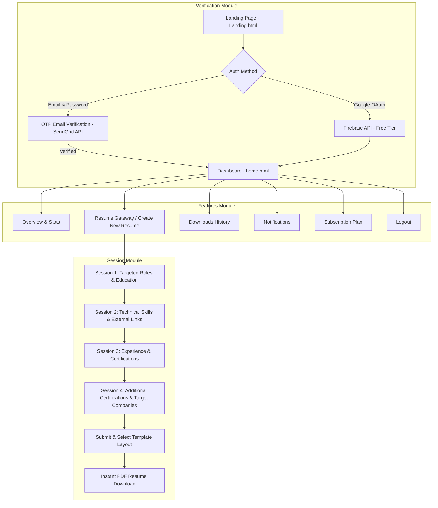

# 🚀 ResuMatch

> **1st Hackathon Collaboration Project**  
> *Empowering job seekers to build polished, ATS-friendly, professional resumes effortlessly through a guided multi-step session builder.*

---

## 🌐 Live Production Deployment
- **Live App URL**: [https://resumatch-api-jkau.onrender.com](https://resumatch-api-jkau.onrender.com)
- **Status**: ✅ **100% COMPLETED & LIVE ON RENDER**

---

## 👥 Project Team & Contributors

| Contributor | Project Role / Post | GitHub Profile | Responsibilities |
|---|---|---|---|
| **Parth Sonavane** | **Backend Developer & System Architect** | [@parthongit89](https://github.com/parthongit89) | Flask REST API, Database ORM (SQLAlchemy), OTP Email Verification (SendGrid), Firebase OAuth, 4-Session Engine & PDF Exporter |
| **Harshal** | **Frontend Developer & UI/UX Engineer** | [@Ghostofzenin08](https://github.com/Ghostofzenin08) | Landing Page, Authentication & OTP Modals, Dashboard, Multi-step Session Form Wizard, Live Preview Renderer |

---

## 🎯 Problem Statement & Solution

### The Problem:
Most job seekers and students struggle with poorly structured, non-ATS compliant resumes that get rejected by automated applicant tracking systems. Manual resume formatting in conventional word processors is frustrating, time-consuming, and prone to layout breaking.

### The ResuMatch Solution:
ResuMatch provides an intuitive, **session-based multi-step resume builder**:
1. **Seamless Authentication**: Login via Email OTP (SendGrid) or 1-Click Google Login (Firebase API).
2. **Guided 4-Session Builder**: Input details step-by-step across 8 targeted categories without cognitive overload.
3. **Live Real-time Preview**: See changes instantly on professional, ATS-optimized layouts.
4. **Instant PDF Export**: High-quality, one-click downloadable PDF resumes ready for job applications.

---

## 🏗️ Architecture & Module Workflow



---

## 🛠️ Technology Stack

### Backend Stack (Python / Flask)
- **Web Framework**: Python 3.10+, Flask 3.x (App Factory & Blueprints)
- **Database & ORM**: Flask-SQLAlchemy (PostgreSQL / SQLite), Flask-Migrate (Alembic)
- **Authentication**: Flask-JWT-Extended, SendGrid API (Email OTP), Firebase API (Google OAuth)
- **Security & Rate Limiting**: Flask-CORS, Flask-Limiter, Werkzeug Security / bcrypt
- **PDF Engine**: WeasyPrint / ReportLab
- **Production Server**: Gunicorn (Deployed on Render)

### Frontend Stack (HTML / CSS / JS)
- **UI Framework**: HTML5, Tailwind CSS / Custom CSS
- **State Management**: Client-side Session State Manager (7-Step Wizard Persistence)
- **HTTP Client**: Axios / Fetch API with JWT Interceptors
- **Hosting**: Vercel CDN

---

## 📁 Repository Directory Structure

```
ResuMatch/
├── .env.example                     # Environment Credentials Template
├── .gitignore                        # Git Ignored Files (.env, secrets)
├── README.md                        # Project Overview & Guide
├── Modules/                         # Feature Architecture Diagrams
│   ├── Folder_based_structure.md
│   ├── Session architecture.png
│   ├── Verification_arc.png
│   └── features.png
├── projectmd/                       # Detailed System Architecture Documentation
│   ├── PRD.md                       # Product Requirements Document
│   ├── Architecture.md              # System Architecture & REST API Specs
│   ├── Phases.md                    # Developer Sprint Roadmap
│   ├── rules.md                     # Coding Standards & Response Protocols
│   ├── Designs.md                   # UI/UX & Session Inputs Breakdown
│   ├── Security_audits.md           # Security & CORS Guidelines
│   ├── Color_theory.md              # Brand & Resume Color Palettes
│   ├── Typography_icons.md          # Fonts & Icon Standards
│   ├── Deployment_render.md         # Render Backend Deployment Guide
│   └── Deployment_vercel.md         # Vercel Frontend Deployment Guide
├── frontend/                        # Frontend Application Code (Landing, Login, Signup, Home)
│   ├── Landing.html
│   ├── login.html
│   ├── signup.html
│   ├── otp-verify.html
│   ├── home.html
│   └── assets/
└── src/                            # Flask Backend Application Code
    ├── app.py                      # App Factory (create_app)
    ├── config/                     # Environment Configurations
    ├── controllers/                # REST Controllers
    ├── services/                   # Business Logic Services
    ├── repositories/               # Database Query Abstraction
    ├── models/                     # SQLAlchemy Models
    ├── routes/                     # Flask Blueprints
    └── utils/                      # Helper Functions (OTP, Email, PDF)
```

---

## 🚀 Local Development Setup

1. **Clone the Repository**:
   ```bash
   git clone https://github.com/parthongit89/ResuMatch.git
   cd ResuMatch
   ```

2. **Set Up Python Virtual Environment**:
   ```bash
   python -m venv venv
   # On Windows:
   venv\Scripts\activate
   # On macOS/Linux:
   source venv/bin/activate
   ```

3. **Install Dependencies**:
   ```bash
   pip install -r requirements.txt
   ```

4. **Configure Environment Variables**:
   Copy `.env.example` to `.env` and plug in your active credentials:
   ```bash
   cp .env.example .env
   ```

5. **Run the Flask Development Server**:
   ```bash
   python src/app.py
   ```

---

## 📜 License & Acknowledgments
Designed & Developed with ❤️ by **Parth Sonavane** ([@parthongit89](https://github.com/parthongit89)) & **Harshal** ([@Ghostofzenin08](https://github.com/Ghostofzenin08)) for the Hackathon.
