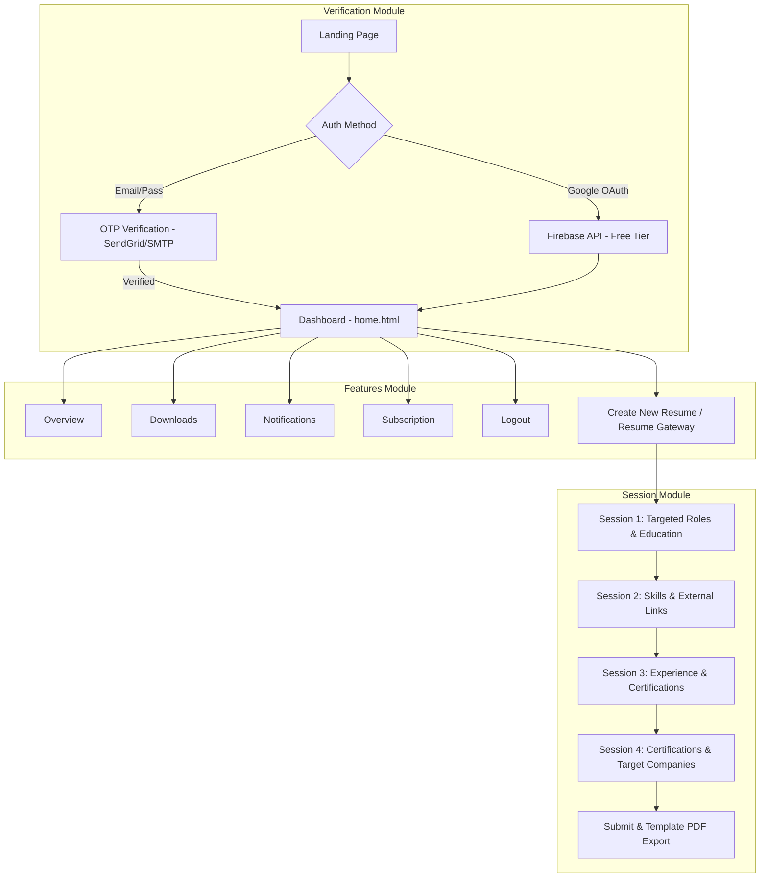

# ResuMatch - System Architecture & Backend Specs

## 1. System Overview
ResuMatch follows a **decoupled Client-Server Architecture**:
- **Backend (Python / Flask Framework)**: Complete Flask RESTful API service handling Verification (OTP/SendGrid/Firebase), Dashboard Features (Overview, Downloads, Notifications, Subscription), 4-Session State Management, Database ORM (SQLAlchemy), and PDF Export engine.
- **Frontend (React / Next.js / HTML+Tailwind)**: UI handling Landing Page, OTP Auth modals, Dashboard, Multi-step Session Wizard, Live Preview state engine, and Template renderer.

---

## 2. Architecture Modules Mapping



---

## 3. Complete Flask Backend Libraries & Tech Stack

| Category | Library / Package | Version / Purpose |
|---|---|---|
| **Core Framework** | `Flask` | Micro-web framework for routing and REST API controllers |
| **WSGI Server** | `gunicorn` | Production WSGI HTTP server for Render deployment |
| **Database ORM** | `Flask-SQLAlchemy` | ORM for database models, relationships, and queries |
| **Database Migrations**| `Flask-Migrate` / `Alembic` | Handles database schema migrations cleanly |
| **Database Drivers** | `psycopg2-binary` / `sqlite3` | PostgreSQL driver (Production) & SQLite (Local Dev) |
| **Authentication & OTP**| `Flask-JWT-Extended`, `sendgrid` | JWT tokens & SendGrid API for OTP email verification |
| **OAuth** | `firebase-admin` / PyJWT | Firebase API integration for Google OAuth verification |
| **Password Hashing** | `Werkzeug` / `bcrypt` | Password hashing (`generate_password_hash`, `check_password_hash`) |
| **CORS Protection** | `Flask-CORS` | Cross-Origin Resource Sharing control |
| **Validation** | `marshmallow` / `pydantic` | Request payload validation and serialization |
| **Rate Limiting** | `Flask-Limiter` | Endpoint protection against spam/brute-force |
| **PDF Engine** | `WeasyPrint` / `ReportLab` | Converts HTML/CSS templates to downloadable PDF resumes |
| **Environment Config** | `python-dotenv` | Loads `.env` credentials |

---

## 4. Directory Structure (Feature-Based Flask Config)

Matches `Modules/Folder_based_structure.md`:

```
ResuMatch/
├── .env
├── .env.example
├── .gitignore
├── README.md
├── Modules/
│   ├── Folder_based_structure.md
│   ├── Session architecture.png
│   ├── Verification_arc.png
│   └── features.png
├── projectmd/
│   ├── PRD.md
│   ├── Architecture.md
│   ├── Phases.md
│   ├── rules.md
│   ├── Designs.md
│   ├── Security_audits.md
│   ├── Color_theory.md
│   ├── Typography_icons.md
│   ├── Deployment_render.md
│   ├── Deployment_vercel.md
│   ├── Update.md
│   └── skills.md
└── src/
    ├── app.py                      # Flask App Factory (create_app)
    ├── config/
    │   ├── config.py               # Config classes (Dev, Production)
    │   └── database.py             # SQLAlchemy instance (db)
    ├── controllers/
    │   ├── auth_controller.py      # Verification Module (Login, Signup, OTP, Google)
    │   ├── dashboard_controller.py # Features Module (Overview, Downloads, Notifications, Subscription)
    │   ├── session_controller.py   # Session Module (Session 1 to 4 CRUD)
    │   └── export_controller.py    # Template & PDF Export
    ├── services/
    │   ├── auth_service.py         # OTP & Firebase logic
    │   ├── session_service.py      # 4-Session state machine
    │   ├── pdf_service.py          # WeasyPrint PDF renderer
    │   └── overview/
    │       ├── Dashboard/
    │       ├── Downloads/
    │       ├── Notifications/
    │       ├── logout/
    │       └── subscriptions/
    ├── repositories/
    │   ├── user_repository.py
    │   ├── otp_repository.py
    │   └── resume_repository.py
    ├── models/
    │   ├── user.py                 # User & OTP Session Models
    │   ├── resume.py               # Resume & 4-Session Inputs Models
    │   └── notification.py         # Notifications & Subscriptions Models
    ├── routes/
    │   ├── auth_routes.py          # Verification routes (/api/v1/auth)
    │   ├── dashboard_routes.py     # Features routes (/api/v1/dashboard)
    │   └── session_routes.py       # Session routes (/api/v1/sessions)
    ├── validators/
    │   ├── auth_validator.py
    │   └── session_validator.py
    ├── middleware/
    │   ├── auth_middleware.py
    │   └── error_middleware.py
    └── utils/
        ├── otp_generator.py        # Generates 6-digit OTPs
        ├── email_sender.py         # SendGrid / SMTP email client
        ├── pdf_generator.py        # PDF engine
        └── response_helpers.py
```

---

## 5. API Endpoints Specification

### 5.1 Verification Module Endpoints (`/api/v1/auth`)
- `POST /api/v1/auth/signup` -> Register user & trigger OTP email.
- `POST /api/v1/auth/login` -> Login user & trigger OTP email.
- `POST /api/v1/auth/google-login` -> Verify Firebase Google OAuth token.
- `POST /api/v1/auth/verify-otp` -> Validate OTP code. If valid, return JWT access token.
- `POST /api/v1/auth/resend-otp` -> Resend OTP code via SendGrid/SMTP.

### 5.2 Features Module Endpoints (`/api/v1/dashboard`)
- `GET /api/v1/dashboard/overview` -> Fetch dashboard stats & draft resumes.
- `GET /api/v1/dashboard/downloads` -> Fetch user's downloaded resumes history.
- `GET /api/v1/dashboard/notifications` -> Fetch notifications.
- `GET /api/v1/dashboard/subscription` -> Fetch subscription plan details.
- `POST /api/v1/dashboard/logout` -> Invalidate session & logout.

### 5.3 Session Module Endpoints (`/api/v1/sessions`)
- `POST /api/v1/sessions/start` -> Enter Resume Gateway & initialize 4-session draft.
- `PUT /api/v1/sessions/<id>/step-1` -> Save **Session 1** (Targeted roles/position & Education).
- `PUT /api/v1/sessions/<id>/step-2` -> Save **Session 2** (Technical Skills & External links).
- `PUT /api/v1/sessions/<id>/step-3` -> Save **Session 3** (Experience/Internships & Certifications).
- `PUT /api/v1/sessions/<id>/step-4` -> Save **Session 4** (Certifications & Target companies).
- `GET /api/v1/sessions/<id>` -> Retrieve full 4-session draft.
- `POST /api/v1/sessions/<id>/submit` -> Finalize session data & select template.
- `POST /api/v1/sessions/<id>/export/pdf` -> Download final PDF resume.
