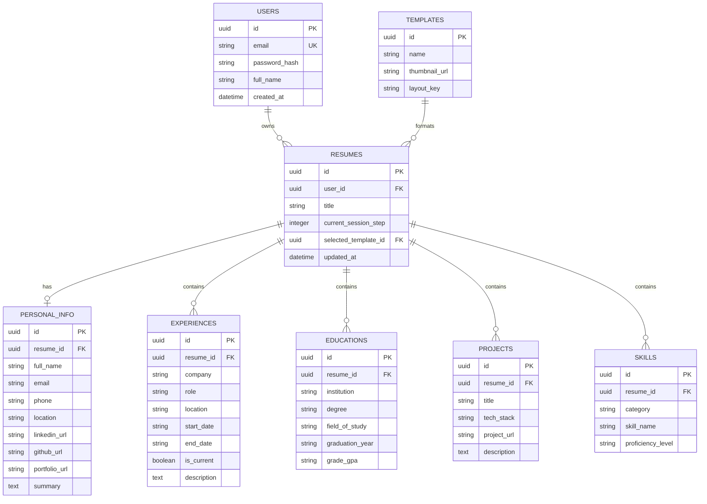

# ResuMatch - System Architecture & Backend Specs

## 1. System Overview
ResuMatch follows a **decoupled Client-Server Architecture**:
- **Backend (Python / Flask)**: REST API handling Authentication, Resume Session Management, Database ORM (SQLAlchemy), and PDF Export engine.
- **Frontend (React / Next.js / HTML+Tailwind)**: UI handling Landing Page, Auth flows, Multi-step Session Wizard, Live Preview state engine, and Template renderer.

---

## 2. Directory Structure (Feature-Based Flask Config)

```
ResuMatch/
├── .env
├── .gitignore
├── README.md
├── Modules/
│   ├── Folder_based_structure.md
│   ├── Session architecture.png
│   └── Verification_arc.png
├── projectmd/
│   ├── PRD.md
│   ├── Architecture.md
│   ├── Phases.md
│   ├── rules.md
│   ├── Designs.md
│   ├── Security_audits.md
│   ├── Color_theory.md
│   ├── Typography_icons.md
│   ├── Deployment_render.md
│   ├── Deployment_vercel.md
│   ├── Update.md
│   └── skills.md
└── src/
    ├── config/
    │   ├── config.py
    │   └── database.py
    ├── controllers/
    │   ├── auth_controller.py
    │   ├── resume_controller.py
    │   ├── template_controller.py
    │   └── export_controller.py
    ├── services/
    │   ├── auth_service.py
    │   ├── session_service.py
    │   ├── pdf_service.py
    │   └── overview/
    │       ├── Dashboard/
    │       ├── Downloads/
    │       ├── Notifications/
    │       ├── logout/
    │       └── subscriptions/
    ├── repositories/
    │   ├── user_repository.py
    │   └── resume_repository.py
    ├── models/
    │   ├── user.py
    │   ├── resume.py
    │   └── template.py
    ├── routes/
    │   ├── auth_routes.py
    │   ├── resume_routes.py
    │   └── template_routes.py
    ├── validators/
    │   ├── auth_validator.py
    │   └── resume_validator.py
    ├── middleware/
    │   ├── auth_middleware.py
    │   └── error_middleware.py
    └── utils/
        ├── pdf_generator.py
        └── response_helpers.py
```

---

## 3. Database Schema Design (SQLAlchemy ORM)



---

## 4. API Endpoints Specification

### 4.1 Authentication
- `POST /api/v1/auth/register`
  - **Body**: `{ "full_name": "...", "email": "...", "password": "..." }`
  - **Response**: `{ "success": true, "data": { "token": "...", "user": {...} } }`
- `POST /api/v1/auth/login`
  - **Body**: `{ "email": "...", "password": "..." }`
  - **Response**: `{ "success": true, "data": { "token": "...", "user": {...} } }`

### 4.2 Resume Sessions (Multi-Step Wizard)
- `POST /api/v1/resumes` -> Create new draft resume session.
- `GET /api/v1/resumes/<id>/session` -> Fetch complete draft data for all 7 sessions.
- `PUT /api/v1/resumes/<id>/session/step-1` -> Save Session 1 (Personal Info).
- `PUT /api/v1/resumes/<id>/session/step-2` -> Save Session 2 (Summary).
- `PUT /api/v1/resumes/<id>/session/step-3` -> Save Session 3 (Work Experience).
- `PUT /api/v1/resumes/<id>/session/step-4` -> Save Session 4 (Education).
- `PUT /api/v1/resumes/<id>/session/step-5` -> Save Session 5 (Projects).
- `PUT /api/v1/resumes/<id>/session/step-6` -> Save Session 6 (Skills).
- `PUT /api/v1/resumes/<id>/session/step-7` -> Save Session 7 (Template Selection).

### 4.3 Templates & Export
- `GET /api/v1/templates` -> List available designs.
- `POST /api/v1/resumes/<id>/export/pdf` -> Generate and download PDF.
